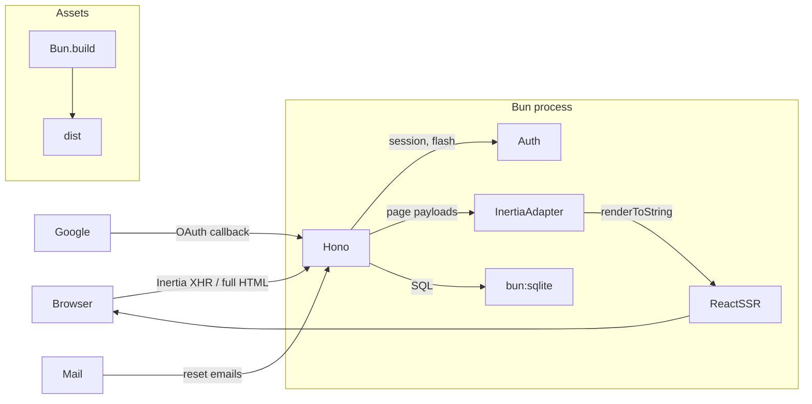

# Dulak

The Banjar word for *bored* — a deliberately boring full-stack starter.

[](https://github.com/maulanashalihin/dulak/actions/workflows/ci.yml)
[](LICENSE)
[](https://bun.sh)
[](https://dulak.pages.dev)
[](https://www.npmjs.com/package/create-dulak)

A full-stack starter running entirely on **Bun**: **Hono** for HTTP,
**bun:sqlite** for data, **Inertia v3** for server-driven UI with
**in-process SSR** — no separate SSR server, it runs inside the same Bun
process — with React, Svelte, and Vue templates. Auth, uploads,
migrations, tests, Docker — wired end to end.



## Philosophy

**Dulak** is the Banjar word for *bored* — and the name is the manifesto:
code that is "boring" is the most valuable code there is. Boring here does
not mean dull — it means **predictable**. No surprises, no clever tricks
that require the next maintainer to reverse-engineer intent. Whoever comes
later — human or AI agent — should be able to understand the code, change
it, and not be afraid of breaking it.

- **Deliberately boring.** Every choice trades "clever" for "obviously
  right". When two ways of doing the same thing exist, only one is kept —
  the simpler one. Route handlers are written inline in their route file
  instead of being split into abstract controllers. Boring? Yes.
  Followable at a glance? Far more.

- **Zero-dependency where it's cheap.** Every dependency is a liability:
  it must be upgraded, audited, and can break under you. When 60 lines of
  our own code are enough, we write them: the rate limiter is hand-rolled
  (`rate-limit.ts`), the Google OAuth client is plain `fetch` (no SDK),
  CSS is vanilla by default, and the database layer is raw `bun:sqlite`
  prepared statements — no ORM.

- **One runtime, zero setup.** Not a PHP/Laravel-style stack — no separate
  language runtime, package manager, web server, and database to install
  and wire together before your first `php artisan serve`. The whole stack
  is Bun: `Bun.serve` is the HTTP server, `bun:sqlite` is the database,
  `Bun.build` is the bundler, `bun test` is the test runner, `bun install`
  is the package manager. Setup is exactly three steps — install Bun,
  scaffold with `bun create dulak`, run `bun run dev` — and you have a
  running app with auth, migrations, SSR, and tests.

- **One obvious way to do things.** Structure is standardized, on purpose:
  routes only live in `routes/<feature>.routes.ts`, all SQL lives in
  `db.ts`, environment variables are read only in `config.ts`. No
  "structural creativity" — that is the point. When everyone writes the
  same way, anyone can find anything.

- **Discoverability as a contract.** Given a URL you can name the file
  that owns it: `/login` → `routes/auth.routes.ts`, `/uploads` →
  `routes/uploads.routes.ts`. Every URL lives in exactly one file, with
  its GET render and POST actions together. Paste a broken URL and you
  land in exactly one place — no guessing.

- **Production-grade guardrails, not a production app.** The
  infrastructure a deployed app needs — CSRF, rate limiting, security
  headers, versioned migrations, graceful shutdown, Docker, CI — is wired
  and tested from day one, not scaffolded. What is missing is your
  business logic, and that is the point: you start from a skeleton that
  already works, not one you have to harden.

- **Boring versions, pinned, not chased.** A starter gets forked and
  maintained for years — its dependencies decide how much forced
  maintenance lands on the fork owner. "Current" does not mean "always
  the latest": Dulak pins specific stable versions (Hono 4.x, Bun 1.3,
  Inertia v3) and upgrades only when there is a concrete reason. A pinned
  version is a resting point, not a moving target that drags every fork
  into an upgrade cycle.
  - **No inherited rewrite churn.** A dependency whose next major is a
    full rewrite strands the boilerplate on a legacy track with no upgrade
    path.
  - **Breaking changes become schedulable.** On a stable track, upgrades
    are deliberate, documented migrations you can plan and test — not
    emergency fixes when a beta dependency shifts under you.
  - **A new major must prove itself.** It ships when there is a concrete
    reason (security, ecosystem, maintenance), not because it is the
    newest thing.

- **Correctness over cleverness.** Synchronous, explicitly typed,
  parameterized queries; fail-fast configuration; deterministic tests
  (`bun test --isolate`). Prefer the boring implementation that is
  obviously correct over the clever one that is hard to verify.

- **Built for AI agents.** The "next maintainer" includes the agent
  writing the next feature — which, in this project, is the main way the
  code evolves. That is why conventions are codified where agents read
  them (`AGENTS.md`), validation errors have exact, documented shapes
  (TypeBox), mistakes fail at compile time (`strict` +
  `noUncheckedIndexedAccess`), and the test suite runs deterministically
  as the safety net. A codebase an agent can extend without inventing
  conventions is a codebase that stays coherent.

## Quick start

```bash
# Scaffold a new project (prompts for template, installs deps, creates .env)
bun create dulak@latest my-app
cd my-app
bun run dev          # http://localhost:4000

# Or pick a template directly:
bun create dulak@latest my-app --template svelte-vanilla
```

### Templates

| Template          | Stack                              | Branch                    |
| ----------------- | ---------------------------------- | ------------------------- |
| `default`         | React 19 + vanilla CSS             | `main`                    |
| `svelte-vanilla`  | Svelte 5 + scoped `<style>` CSS    | `template/svelte-vanilla` |
| `vue-vanilla`     | Vue 3 + scoped `<style>` CSS       | `template/vue-vanilla`    |
| `svelte-tailwind` | Svelte 5 + Tailwind CSS v4         | `template/svelte-tailwind`|
| `react-tailwind`  | React 19 + Tailwind CSS v4         | `template/react-tailwind` |
| `vue-tailwind`    | Vue 3 + Tailwind CSS v4            | `template/vue-tailwind`   |

The `default` template (this branch) uses React 19 with co-located vanilla
CSS — no CSS framework. The `svelte-vanilla` and `vue-vanilla` templates
use native scoped `<style>` blocks (Svelte/Vue SFCs). The `*-tailwind`
templates add Tailwind CSS v4 (via `@tailwindcss/cli`, no PostCSS) with
the same auth, roles, SSR, and test suite.

### Scripts

| Command             | What it does                                              |
| ------------------- | --------------------------------------------------------- |
| `bun run dev`       | Watch mode; rebuilds client assets on restart             |
| `bun run build`     | Prebuild client assets → `dist/` (+ `manifest.json`)      |
| `bun run start`     | Serve prebuilt assets (`NODE_ENV=production`)             |
| `bun run test`      | E2E suite (auth, roles, reset flow, Inertia protocol, tus) |
| `bun run db:seed`   | Create a demo user (`[email] [password] [role]` args)     |
| `bun run typecheck` | `tsc --noEmit`                                            |

## Features

- **Auth**: register, login, logout — argon2id passwords, DB-backed sessions
  (httpOnly `SameSite=Lax` cookies, 30-day expiry), CSRF (Origin check).
- **Forgot / reset password** with email delivery (see Mail below) and
  hashed reset tokens (60-minute expiry).
- **Google OAuth** register-or-login (zero-dep, plain fetch; button hidden
  when not configured). The profile picture is downloaded and stored locally
  (the CSP blocks external images), so avatars always load from our origin.
- **Roles**: `user` / `admin`, `requireRole('admin')` guard, `/admin` page
  with paginated user list.
- **Rate limiting**: global per-IP limit on all routes (DDoS baseline, excludes `/health` and `/assets/*`) plus a stricter layer on auth endpoints (brute-force protection). In-memory fixed window, configurable via env.
- **Inertia v3**: full SSR on first load, SPA navigation after, asset-version
  negotiation (409 + reload), partial reloads, flash messages, shared props.
- **Resumable uploads**: tus protocol v1 at `/uploads` (creation,
  creation-with-upload, termination, expiration, checksum) with SQLite state
  and on-disk storage — demonstrated end to end by the avatar upload on the
  profile page.
- **Migrations**: versioned SQL files applied at startup in transactions.
- **Ops**: batched request logging with correlation id, gzip compression,
  security headers (CSP, nosniff, frame denial), `/health`, graceful
  shutdown, Docker.
- **Testing**: `bun test` — boots the app against an in-memory SQLite DB.

## Configuration (.env)

| Variable | Default | Notes |
| --- | --- | --- |
| `PORT` | `4000` | In dev, auto-increments to the next free port if busy (prod fails fast) |
| `APP_URL` | `http://localhost:4000` | Absolute base URL (email links, OAuth redirects) |
| `DATABASE_PATH` | `./data/app.sqlite` | |
| `SSR` | `true` | `false` ships an empty shell — client renders from scratch (no hydrate) |
| `MAIL_DRIVER` | `log` | `log` \| `resend` \| `mailtrap` |
| `MAIL_FROM` | `no-reply@example.com` | |
| `RESEND_API_KEY` | — | required when `MAIL_DRIVER=resend` |
| `MAILTRAP_API_TOKEN` | — | required when `MAIL_DRIVER=mailtrap` |
| `MAILTRAP_INBOX_ID` | — | use the sandbox endpoint when set |
| `GOOGLE_CLIENT_ID` / `GOOGLE_CLIENT_SECRET` | — | enable Google OAuth (both or none) |
| `RATE_LIMIT_GLOBAL_MAX` / `RATE_LIMIT_GLOBAL_WINDOW` | `200` / `60` | per-IP requests per window on all routes (excludes `/health`, `/assets/*`) |
| `RATE_LIMIT_AUTH_MAX` / `RATE_LIMIT_AUTH_WINDOW` | `30` / `60` | stricter per-IP limit on auth endpoints (brute-force protection) |
| `UPLOAD_DIR` | `./data/uploads` | tus upload bytes on disk |
| `TUS_MAX_SIZE` | `0` | max upload size in bytes (`0` = unlimited) |
| `TUS_EXPIRATION_SECONDS` | `0` | unfinished upload TTL in seconds (`0` = no expiry) |

Invalid/incomplete config fails fast at startup with a clear message
(`src/server/config.ts`).

### Google OAuth setup

1. [Google Cloud Console](https://console.cloud.google.com/apis/credentials) →
   create OAuth client (Web application).
2. Authorized redirect URI: `https://<your-domain>/auth/google/callback`
   (`http://localhost:4000/auth/google/callback` for local dev).
3. Set `GOOGLE_CLIENT_ID` and `GOOGLE_CLIENT_SECRET` in `.env`.

### Mail drivers

- **log** (default): prints a formatted message and records it in
  `sentMails` — usable in dev and asserted in tests.
- **resend**: set `RESEND_API_KEY` (`MAIL_DRIVER=resend`).
- **mailtrap**: set `MAILTRAP_API_TOKEN` (`MAIL_DRIVER=mailtrap`); add
  `MAILTRAP_INBOX_ID` to use the sandbox endpoint.

## Architecture

AI agents: follow [`AGENTS.md`](AGENTS.md) — it codifies the layout rules
below so new code stays structurally consistent.

```
src/
├── index.ts                # entry: build assets (dev), Bun.serve, graceful shutdown
├── server/
│   ├── app.ts              # composition: logging, CSRF, secureHeaders, rate limit, onError, routes
│   ├── config.ts           # validated env config (fails fast)
│   ├── db.ts               # bun:sqlite: connection, prepared statements
│   ├── migrations.ts       # SQL migration runner
│   ├── auth.ts             # argon2id, sessions, flash, cookies, reset tokens, guards
│   ├── inertia.ts          # Inertia v3 server adapter (SSR shell, XHR, 409)
│   ├── inertia-middleware.ts # per-request session resolve → c.var (AppEnv)
│   ├── validation.ts       # TypeBox JSON validation → ValidationFailed (422)
│   ├── mailer.ts           # mail drivers: log / resend / mailtrap
│   ├── rate-limit.ts       # in-memory fixed-window rate limiter
│   ├── logger.ts           # request logging + x-request-id
│   ├── security.ts         # CSRF origin check (headers via hono/secure-headers)
│   ├── url.ts              # defensive request-URL parsing
│   ├── assets.ts           # Bun.build pipeline + manifest + static serving
│   ├── tus-protocol.ts     # tus v1 protocol constants & helpers
│   ├── tus-storage.ts      # tus upload bytes on disk (data/uploads)
│   └── routes/
│       ├── auth.routes.ts         # /login /register /logout /forgot/reset (GET+POST)
│       ├── google-oauth.routes.ts # /auth/google, /auth/google/callback
│       ├── pages.routes.ts        # app-shell pages: /, /dashboard, /admin
│       ├── profile.routes.ts      # /profile page + /profile/avatar
│       └── uploads.routes.ts      # /uploads* (tus resumable upload)
├── client/
│   ├── app.tsx             # Inertia client bootstrap (hydrate or render)
│   ├── ssr.tsx             # in-process SSR renderer (react-dom/server)
│   ├── pages.ts            # explicit page registry (shared by SSR + bundle)
│   ├── pages/              # Login, Register, Dashboard, ForgotPassword,
│   │                       # ResetPassword, Admin, NotFound
│   ├── components/         # Layout, AuthLayout, Field
│   └── styles.css          # plain CSS, light/dark
├── shared/
│   ├── types.ts            # User, Role, FlashData, SharedPageProps, Paginated
│   └── inertia.d.ts        # InertiaConfig augmentation → typed props.auth
├── migrations/             # versioned SQL schema files (0001, 0002, …)
├── tests/                  # bun:test E2E suite (in-memory DB)
└── scripts/                # build.ts, seed.ts
```

## How the pieces fit

- **Request lifecycle**: `requestLogger` (correlation id) → `checkOrigin`
  (CSRF) → `secureHeaders` → inertia session resolve → global rate limit →
  guards + handler → Inertia render (SSR HTML for browsers, JSON for
  `X-Inertia` XHR) → `onError` (422 validation with friendly field
  messages, 500) / `notFound` (404 Inertia page).
- **Auth**: argon2id via `Bun.password`; 256-bit random session tokens in
  SQLite; cookies httpOnly/`SameSite=Lax`/Secure-in-prod. Logout deletes the
  session row server-side. `passwordHash` never leaves the server.
- **Guards** are Hono middleware: `requireAuth`, `guestOnly`,
  `requireRole('admin')` (non-admins redirect to `/dashboard`). They return a
  Response to short-circuit the chain, or call `next()`.
- **Rate limiting** is an in-memory fixed-window limiter keyed by
  `X-Forwarded-For`/peer IP (Bun's `server.requestIP` via `c.env`). Two
  layers: a global limiter in `app.ts` (DDoS baseline, excludes `/health`
  and `/assets/*`) and a stricter one on auth routes (brute-force). Swap
  the store for Redis behind the same hook signature when scaling
  horizontally.
- **Inertia v3 protocol** (`inertia.ts`): full HTML with SSR markup +
  `data-page` JSON for browser visits; JSON page payloads for XHR;
  `409 + X-Inertia-Location` on asset-version mismatch; partial reloads via
  `X-Inertia-Partial-*`; one-shot flash and shared props merged per page.
- **SSR + hydration**: `renderPage()` renders with
  `createInertiaApp({ page, render: renderToString })`; the client hydrates
  when `data-server-rendered` is present. Same page registry on both sides.
- **Asset versioning**: `Bun.build` emits content-hashed files; the hash is
  the Inertia `version`. Stale clients get a 409 and reload.
- **Validation**: TypeBox schemas at the route level (see
  `src/server/validation.ts`); `onError` maps `ValidationFailed` to 422
  Inertia page payloads (`VALIDATION_MESSAGES` in
  `routes/auth.routes.ts`). The `email` format is registered explicitly —
  plain `@sinclair/typebox` does not pre-register string formats.

## Database migrations

Schema changes are plain SQL files in `migrations/`, applied automatically at
startup in filename order, each inside a transaction, recorded in
`schema_migrations` (never re-applied).

```bash
# add a column to an existing table
cat > migrations/0003_add_last_login.sql <<'SQL'
ALTER TABLE users ADD COLUMN last_login_at TEXT;
SQL
bun run dev   # migration runs on boot
```

Rules:

- **Never edit an applied migration** — add a new numbered file instead.
- SQLite `ALTER TABLE ADD COLUMN` with `NOT NULL` requires a `DEFAULT`.
- A failed migration rolls back and aborts startup.
- Edited an applied migration anyway (e.g. while prototyping)? Applied
  migrations are never re-run, so delete `data/app.sqlite*` and re-start to
  rebuild the dev database from scratch.

## Testing

```bash
bun test --isolate   # or: bun run test
```

63 tests (snapshot — the suite grows; AGENTS.md only requires it stays green). The suite boots the full app against an in-memory SQLite database
and drives it through `app.request()`: registration/login/logout, guards and
roles, password reset end to end (via the log mail driver), Inertia protocol
(409/404/SSR), CSRF, `/health`, static asset serving, and the tus
resumable-upload flow (creation, resume, checksum, termination, ownership).

`--isolate` gives each test file fresh globals. It is required: the files
are written as independent suites — each sets its env (`DATABASE_PATH`,
`UPLOAD_DIR`, …) in `beforeAll` before importing the app, and `db.close()`s
in `afterAll` — so running them in one shared process would let one file's
teardown finalize the next file's prepared statements.

## Deployment

```bash
docker compose up -d --build
```

- Multi-stage `Dockerfile` (`oven/bun:1.3-alpine`): assets prebuilt in the
  build stage, production deps only at runtime.
- `./data` volume keeps the SQLite database across restarts; healthcheck hits
  `/health`.

Alternatives: `bun build --compile` for a single binary, or plain
`bun run start` behind your process supervisor (it handles SIGTERM
gracefully). No Docker? Follow the
[Linux VPS guide](https://dulak.pages.dev/deployment/vps/) — Bun +
systemd + Cloudflare (origin rule or tunnel), no reverse proxy to
install.

## Styling

**Vanilla CSS by design** (`src/client/styles.css`, ~6KB): design tokens via CSS
variables, light/dark via `prefers-color-scheme`, no framework. Chosen to keep
the starter zero-dependency and zero extra build steps — the CSS is bundled and
content-hashed by the same `Bun.build` pipeline as the JS.

Adding **Tailwind v4** is a per-project decision — the boilerplate stays
vanilla CSS by design. It is verified to work without PostCSS using only
`@tailwindcss/cli` as a pre-build step; dark mode and existing CSS variables
bridge cleanly. See the
[Tailwind v4 setup guide](.llm-wiki/wiki/concepts/tailwind-v4-setup.md).

## Notes / decisions

- **Hono integration gotchas handled**: Hono converts HEAD requests to GET
  (body stripped, headers kept) while `c.req.method` still reports "HEAD" —
  the tus `dispatch` uses that to route HEAD correctly; `c.header()`-queued
  headers (cookies!) are dropped when a handler returns a custom `Response`,
  so cookie helpers append to `c.res.headers` directly; the `/*` wildcard
  produces no named param, so upload ids are derived from `c.req.path`;
  `hono/conninfo`'s ESM build is an empty stub in 4.13, so the rate limiter
  reads the peer IP from `c.env` (the Bun server) instead.
- `import.meta.glob` was removed from Bun 1.3 — the page registry uses
  explicit imports.
- In dev, `bun --watch` rebuilds client assets on every change, so the
  Inertia version changes; an already-open tab does one 409 + full page
  reload after a rebuild (version negotiation), then settles back to SPA
  navigation. Refresh after a server restart if you see a one-off reload.
- CSP uses `script-src 'unsafe-inline'` because Inertia embeds the page
  payload as inline JSON; external script injection is still blocked.
- `X-Forwarded-For` is trusted for rate limiting — only run behind a proxy
  that sets it.
- gzip compression is a custom middleware (`compress.ts`) — Hono's built-in
  relies on the Web `CompressionStream`, which is not reliably present in
  every Bun 1.3.14 context; `node:zlib` is. `busy_timeout = 5000` is set so
  concurrent writes wait instead of failing with SQLITE_BUSY.
- Prefer Svelte, Vue, or Tailwind? `bun create dulak@latest my-app --template svelte-tailwind`
  (or `react-tailwind` / `vue-tailwind`). The server side is adapter-agnostic —
  Inertia v3 works with React, Svelte, or Vue. The Svelte template follows a
  verified migration guide (Bun.build plugin, SSR, API mapping) in the
  [Svelte 5 migration guide](.llm-wiki/wiki/concepts/svelte-5-migration.md);
  the Vue template uses the same architecture (`vue-plugin.ts`, `@inertiajs/vue3`).
